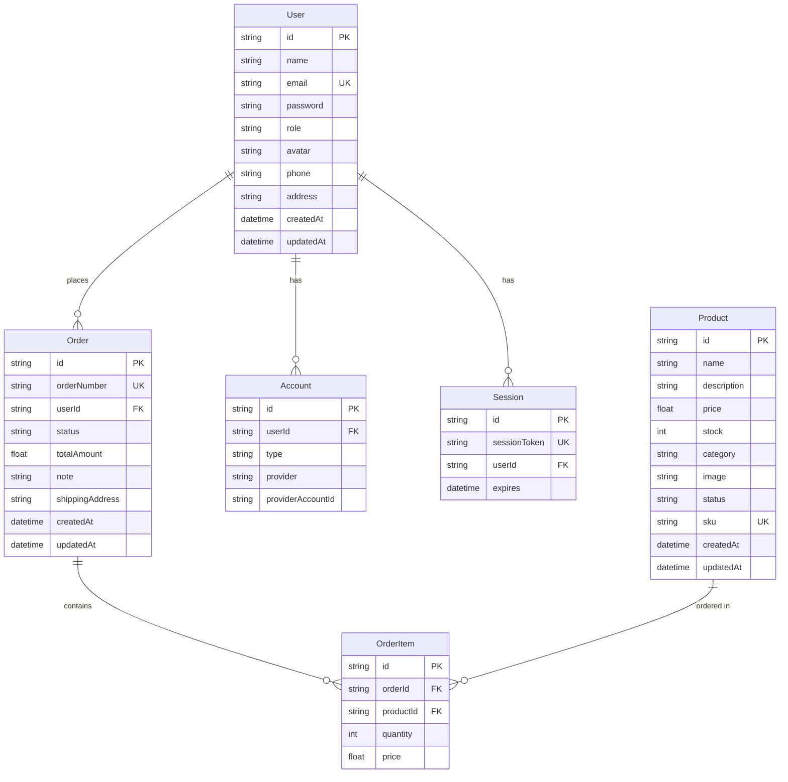

<p align="center">
  
  
  
  
  
</p>

# 🛒 NexStore — Premium Tech E-Commerce

> **Ứng dụng E-Commerce full-stack** được xây dựng với Next.js 16 App Router, React 19 Server Components, Prisma ORM và Tailwind CSS 4. Bao gồm storefront khách hàng và admin dashboard quản trị.

---

## 📋 Mục lục

- [Tổng quan](#-tổng-quan)
- [Demo Screenshots](#-demo-screenshots)
- [Tính năng](#-tính-năng)
- [Tech Stack](#-tech-stack)
- [Kiến trúc dự án](#-kiến-trúc-dự-án)
- [Cài đặt & Chạy](#-cài-đặt--chạy)
- [Biến môi trường](#-biến-môi-trường)
- [Database Schema](#-database-schema)
- [API Routes](#-api-routes)
- [Cấu trúc thư mục](#-cấu-trúc-thư-mục)
- [Tài khoản Demo](#-tài-khoản-demo)
- [Scripts](#-scripts)
- [Công nghệ & Thư viện](#-công-nghệ--thư-viện)
- [Đóng góp](#-đóng-góp)
- [Giấy phép](#-giấy-phép)

---

## 🌟 Tổng quan

**NexStore** là một ứng dụng thương mại điện tử premium chuyên bán các sản phẩm công nghệ (laptop, smartphone, tablet, phụ kiện...). Dự án được thiết kế theo hướng **production-ready** với giao diện hiện đại, hiệu ứng glassmorphism, dark mode, và trải nghiệm mượt mà trên mọi thiết bị.

### Hai phần chính:

| Module | Mô tả |
|--------|-------|
| 🏪 **Storefront** | Giao diện khách hàng — duyệt sản phẩm, giỏ hàng, checkout, quản lý đơn hàng |
| 📊 **Admin Dashboard** | Bảng điều khiển quản trị — CRUD sản phẩm, quản lý đơn hàng, người dùng, thống kê doanh thu |

---

## ✨ Tính năng

### 🏪 Storefront (Khách hàng)

- **Trang chủ Premium** — Hero section với animated gradient, countdown flash sale, testimonials carousel, brands marquee, animated counters
- **Danh sách sản phẩm** — Lọc theo danh mục, tìm kiếm, phân trang
- **Chi tiết sản phẩm** — Hình ảnh lớn, mô tả, thêm vào giỏ hàng
- **Giỏ hàng** — Quản lý số lượng, tổng tiền, client-side state với Zustand
- **Thanh toán (Checkout)** — Form đặt hàng với validation (Zod + React Hook Form)
- **Hồ sơ cá nhân** — Xem/chỉnh sửa thông tin, lịch sử đơn hàng
- **Tìm kiếm nhanh** — Search modal (Cmd+K) với debounce
- **Dark/Light Mode** — Theme switching với `next-themes`
- **Responsive Design** — Hoạt động hoàn hảo trên mobile, tablet, desktop

### 📊 Admin Dashboard (Quản trị)

- **Tổng quan (Overview)** — Thống kê doanh thu, đơn hàng, sản phẩm, người dùng
- **Biểu đồ** — Revenue chart, Order status distribution chart (Recharts)
- **Quản lý sản phẩm** — CRUD đầy đủ, upload ảnh, trạng thái (active/draft/archived)
- **Quản lý đơn hàng** — Danh sách, chi tiết, cập nhật trạng thái đơn hàng
- **Quản lý người dùng** — Danh sách người dùng, phân quyền (admin/user)
- **Top Products** — Bảng sản phẩm bán chạy nhất

### 🔐 Authentication & Authorization

- **NextAuth.js v5** — Credentials provider với JWT strategy
- **Bcrypt** — Hash password an toàn
- **Role-based Access Control** — Phân quyền admin/user
- **Protected Routes** — Middleware bảo vệ dashboard admin

---

## 🛠 Tech Stack

| Layer | Công nghệ |
|-------|-----------|
| **Framework** | [Next.js 16](https://nextjs.org/) (App Router, Server Components) |
| **UI Library** | [React 19](https://react.dev/) |
| **Language** | [TypeScript 5](https://www.typescriptlang.org/) |
| **Styling** | [Tailwind CSS 4](https://tailwindcss.com/) |
| **UI Components** | [shadcn/ui](https://ui.shadcn.com/) + [Lucide Icons](https://lucide.dev/) |
| **State Management** | [Zustand](https://zustand-demo.pmnd.rs/) (Cart) + [TanStack React Query](https://tanstack.com/query) (Server state) |
| **Forms** | [React Hook Form](https://react-hook-form.com/) + [Zod](https://zod.dev/) validation |
| **Database** | [SQLite](https://www.sqlite.org/) via [better-sqlite3](https://github.com/WiseLibs/better-sqlite3) |
| **ORM** | [Prisma 7](https://www.prisma.io/) |
| **Authentication** | [NextAuth.js v5](https://authjs.dev/) (Auth.js) |
| **Charts** | [Recharts](https://recharts.org/) |
| **Font** | [Plus Jakarta Sans](https://fonts.google.com/specimen/Plus+Jakarta+Sans) |
| **Notifications** | [Sonner](https://sonner.emilkowal.dev/) (Toast) |
| **Date Utilities** | [date-fns](https://date-fns.org/) |

---

## 🏗 Kiến trúc dự án

```
┌─────────────────────────────────────────────────────────┐
│                      CLIENT BROWSER                     │
├─────────────────────────────────────────────────────────┤
│                                                         │
│  ┌──────────────┐  ┌──────────────┐  ┌──────────────┐  │
│  │  Storefront   │  │   Auth Pages  │  │  Dashboard   │  │
│  │  (shop)       │  │  login/       │  │  /dashboard  │  │
│  │  /products    │  │  register     │  │  /products   │  │
│  │  /cart        │  │               │  │  /orders     │  │
│  │  /checkout    │  │               │  │  /users      │  │
│  │  /profile     │  │               │  │              │  │
│  └──────┬───────┘  └──────┬───────┘  └──────┬───────┘  │
│         │                 │                  │          │
├─────────┴─────────────────┴──────────────────┴──────────┤
│                    NEXT.JS APP ROUTER                   │
│              (Server Components + API Routes)           │
├─────────────────────────────────────────────────────────┤
│                                                         │
│  ┌──────────────┐  ┌──────────────┐  ┌──────────────┐  │
│  │  API Routes   │  │  NextAuth.js  │  │   Prisma     │  │
│  │  /api/*       │  │  JWT + RBAC   │  │   ORM        │  │
│  └──────┬───────┘  └──────┬───────┘  └──────┬───────┘  │
│         │                 │                  │          │
├─────────┴─────────────────┴──────────────────┴──────────┤
│                     SQLite Database                     │
│                      (dev.db)                           │
└─────────────────────────────────────────────────────────┘
```

---

## 🚀 Cài đặt & Chạy

### Yêu cầu hệ thống

- **Node.js** >= 18.x
- **npm** >= 9.x (hoặc pnpm/yarn)

### Bước 1: Clone repository

```bash
git clone https://github.com/<your-username>/nexstore.git
cd nexstore
```

### Bước 2: Cài đặt dependencies

```bash
npm install
```

### Bước 3: Cấu hình biến môi trường

```bash
cp .env.example .env
```

Chỉnh sửa file `.env` với các giá trị phù hợp (xem phần [Biến môi trường](#-biến-môi-trường)).

### Bước 4: Khởi tạo database

```bash
# Generate Prisma Client
npx prisma generate

# Push schema lên database (tạo tables)
npx prisma db push

# Seed dữ liệu mẫu
npx tsx prisma/seed.ts
```

### Bước 5: Chạy ứng dụng

```bash
npm run dev
```

Truy cập ứng dụng tại **[http://localhost:3000](http://localhost:3000)**

---

## 🔑 Biến môi trường

| Biến | Mô tả | Giá trị mặc định |
|------|--------|-------------------|
| `DATABASE_URL` | Đường dẫn database SQLite | `file:./dev.db` |
| `AUTH_SECRET` | Secret key cho NextAuth.js (JWT signing) | — (bắt buộc) |
| `NEXTAUTH_URL` | Base URL của ứng dụng | `http://localhost:3000` |

> **Lưu ý**: Chạy `npx auth secret` hoặc `openssl rand -base64 32` để tạo `AUTH_SECRET` an toàn.

---

## 🗄 Database Schema



### Trạng thái

| Entity | Trạng thái |
|--------|-----------|
| **Product.status** | `active` · `draft` · `archived` |
| **Order.status** | `pending` · `processing` · `shipped` · `delivered` · `cancelled` |
| **User.role** | `admin` · `user` |

---

## 🔌 API Routes

### Authentication
| Method | Endpoint | Mô tả |
|--------|----------|-------|
| `POST` | `/api/auth/[...nextauth]` | NextAuth.js handler (login, logout, session) |
| `POST` | `/api/auth/register` | Đăng ký tài khoản mới |

### Products
| Method | Endpoint | Mô tả |
|--------|----------|-------|
| `GET` | `/api/products` | Lấy danh sách sản phẩm (có filter, search, pagination) |
| `POST` | `/api/products` | Tạo sản phẩm mới (Admin) |
| `GET` | `/api/products/[id]` | Chi tiết sản phẩm |
| `PUT` | `/api/products/[id]` | Cập nhật sản phẩm (Admin) |
| `DELETE` | `/api/products/[id]` | Xoá sản phẩm (Admin) |

### Orders
| Method | Endpoint | Mô tả |
|--------|----------|-------|
| `GET` | `/api/orders` | Danh sách đơn hàng |
| `POST` | `/api/checkout` | Tạo đơn hàng (Checkout) |
| `PUT` | `/api/orders/[id]` | Cập nhật trạng thái đơn hàng (Admin) |

### Users
| Method | Endpoint | Mô tả |
|--------|----------|-------|
| `GET` | `/api/users` | Danh sách người dùng (Admin) |
| `PUT` | `/api/users/[id]` | Cập nhật thông tin người dùng |

### Dashboard
| Method | Endpoint | Mô tả |
|--------|----------|-------|
| `GET` | `/api/dashboard/stats` | Thống kê tổng quan |

### Upload
| Method | Endpoint | Mô tả |
|--------|----------|-------|
| `POST` | `/api/upload` | Upload hình ảnh sản phẩm |

---

## 📁 Cấu trúc thư mục

```
project-react/
├── prisma/
│   ├── schema.prisma          # Database schema definition
│   ├── seed.ts                # Seed data script
│   └── dev.db                 # SQLite database file
├── public/                    # Static assets
├── src/
│   ├── app/
│   │   ├── (shop)/            # Route group — Storefront
│   │   │   ├── page.tsx       # Homepage
│   │   │   ├── layout.tsx     # Shop layout (navbar, footer)
│   │   │   ├── products/      # Product listing page
│   │   │   ├── product/[id]/  # Product detail page
│   │   │   ├── cart/          # Shopping cart
│   │   │   ├── checkout/      # Checkout flow
│   │   │   ├── profile/       # User profile & order history
│   │   │   ├── about/         # About page
│   │   │   └── contact/       # Contact page
│   │   ├── dashboard/         # Admin Dashboard
│   │   │   ├── page.tsx       # Overview & stats
│   │   │   ├── products/      # Product management (CRUD)
│   │   │   ├── orders/        # Order management
│   │   │   └── users/         # User management
│   │   ├── login/             # Login page
│   │   ├── register/          # Register page
│   │   ├── api/               # API Route Handlers
│   │   │   ├── auth/          # NextAuth endpoints
│   │   │   ├── products/      # Product CRUD API
│   │   │   ├── orders/        # Order API
│   │   │   ├── users/         # User API
│   │   │   ├── checkout/      # Checkout API
│   │   │   ├── dashboard/     # Dashboard stats API
│   │   │   └── upload/        # File upload API
│   │   ├── layout.tsx         # Root layout
│   │   └── globals.css        # Global styles & design tokens
│   ├── components/
│   │   ├── ui/                # shadcn/ui components (22 components)
│   │   │   ├── button.tsx
│   │   │   ├── card.tsx
│   │   │   ├── dialog.tsx
│   │   │   ├── dropdown-menu.tsx
│   │   │   ├── input.tsx
│   │   │   ├── select.tsx
│   │   │   ├── table.tsx
│   │   │   ├── tabs.tsx
│   │   │   └── ...
│   │   ├── layout/
│   │   │   ├── header.tsx     # Dashboard header
│   │   │   └── sidebar.tsx    # Dashboard sidebar navigation
│   │   ├── store-navbar.tsx   # Storefront navigation bar
│   │   ├── search-modal.tsx   # Global search (Cmd+K)
│   │   ├── testimonial-carousel.tsx
│   │   ├── countdown-timer.tsx
│   │   ├── animated-counter.tsx
│   │   ├── brands-marquee.tsx
│   │   ├── providers.tsx      # App providers (Query, Theme, Session)
│   │   └── theme-provider.tsx
│   ├── features/
│   │   ├── dashboard/         # Dashboard-specific components
│   │   │   ├── revenue-chart.tsx
│   │   │   ├── order-status-chart.tsx
│   │   │   └── top-products-table.tsx
│   │   └── products/
│   │       └── product-form.tsx  # Product create/edit form
│   ├── hooks/
│   │   ├── use-cart.ts        # Shopping cart hook (Zustand)
│   │   └── use-debounce.ts    # Debounce utility hook
│   ├── lib/
│   │   ├── auth.ts            # NextAuth.js configuration
│   │   ├── prisma.ts          # Prisma client singleton
│   │   ├── schemas.ts         # Zod validation schemas
│   │   ├── constants.ts       # App constants
│   │   ├── api-response.ts    # API response helpers
│   │   ├── require-admin.ts   # Admin authorization guard
│   │   └── utils.ts           # Utility functions (cn, etc.)
│   ├── store/
│   │   └── use-app-store.ts   # Global app state (Zustand)
│   ├── types/
│   │   ├── next-auth.d.ts     # NextAuth type augmentation
│   │   ├── product.ts         # Product types
│   │   ├── order.ts           # Order types
│   │   └── user.ts            # User types
│   ├── utils/
│   │   └── formatters.ts      # Number/currency/date formatters
│   └── proxy.ts               # API proxy utilities
├── .env.example               # Environment variables template
├── .gitignore
├── components.json            # shadcn/ui configuration
├── eslint.config.mjs          # ESLint configuration
├── next.config.ts             # Next.js configuration
├── package.json
├── postcss.config.mjs         # PostCSS (Tailwind)
├── prisma.config.ts           # Prisma config
├── tsconfig.json              # TypeScript configuration
└── README.md                  # ← Bạn đang đọc file này
```

---

## 👤 Tài khoản Demo

Sau khi chạy seed data, bạn có thể đăng nhập với:

| Role | Email | Password |
|------|-------|----------|
| 🔑 **Admin** | `admin@example.com` | `admin123` |
| 👤 **User** | `user@example.com` | `user123` |
| 👤 **User** | `user2@example.com` | `user123` |

> **Admin** có quyền truy cập Dashboard tại `/dashboard`

---

## 📜 Scripts

| Script | Lệnh | Mô tả |
|--------|-------|-------|
| Dev Server | `npm run dev` | Chạy development server (hot-reload) |
| Build | `npm run build` | Build production bundle |
| Start | `npm run start` | Chạy production server |
| Lint | `npm run lint` | Kiểm tra linting (ESLint) |
| Lint Fix | `npm run lint:fix` | Tự động sửa lỗi lint |
| Type Check | `npm run typecheck` | Kiểm tra TypeScript types |
| Prisma Studio | `npx prisma studio` | GUI quản lý database |
| DB Push | `npx prisma db push` | Đẩy schema lên database |
| Generate | `npx prisma generate` | Generate Prisma Client |
| Seed | `npx tsx prisma/seed.ts` | Seed dữ liệu mẫu |

---

## 📦 Công nghệ & Thư viện

<details>
<summary><strong>Dependencies (Production)</strong></summary>

| Package | Version | Mục đích |
|---------|---------|----------|
| `next` | 16.2.6 | React framework (App Router) |
| `react` / `react-dom` | 19.2.4 | UI library |
| `@prisma/client` | 7.8.0 | Database ORM |
| `better-sqlite3` | 12.10.0 | SQLite driver |
| `next-auth` | 5.0.0-beta.31 | Authentication |
| `bcryptjs` | 3.0.3 | Password hashing |
| `zustand` | 5.0.13 | Client state management |
| `@tanstack/react-query` | 5.100.10 | Server state & caching |
| `react-hook-form` | 7.76.0 | Form management |
| `zod` | 4.4.3 | Schema validation |
| `recharts` | 3.8.1 | Charts & data visualization |
| `lucide-react` | 1.16.0 | Icons |
| `sonner` | 2.0.7 | Toast notifications |
| `next-themes` | 0.4.6 | Dark/Light mode |
| `date-fns` | 4.1.0 | Date utilities |
| `cmdk` | 1.1.1 | Command palette (search) |
| `shadcn` | 4.7.0 | UI component toolkit |

</details>

<details>
<summary><strong>DevDependencies</strong></summary>

| Package | Version | Mục đích |
|---------|---------|----------|
| `typescript` | 5.x | Type safety |
| `tailwindcss` | 4.x | Utility-first CSS |
| `@tailwindcss/postcss` | 4.x | PostCSS integration |
| `eslint` + `eslint-config-next` | 9.x | Code linting |
| `prisma` | 7.8.0 | Prisma CLI |
| `class-variance-authority` | 0.7.1 | Component variants |
| `clsx` + `tailwind-merge` | — | Class merging utilities |

</details>

---

## 🤝 Đóng góp

1. Fork repository
2. Tạo feature branch (`git checkout -b feat/amazing-feature`)
3. Commit thay đổi (`git commit -m 'feat: add amazing feature'`)
4. Push lên branch (`git push origin feat/amazing-feature`)
5. Mở Pull Request

> Tuân thủ [Conventional Commits](https://www.conventionalcommits.org/) cho commit messages.

---

## 📄 Giấy phép

Dự án này được phát hành dưới giấy phép **MIT**. Xem file [LICENSE](LICENSE) cho chi tiết.

---

<p align="center">
  Made with ❤️ using Next.js, React & TypeScript
</p>
